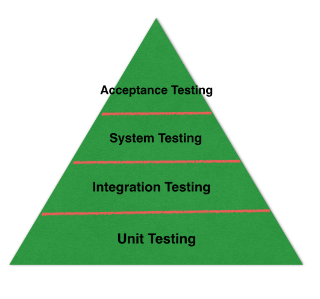
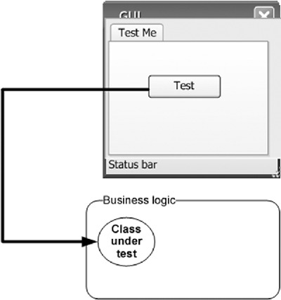
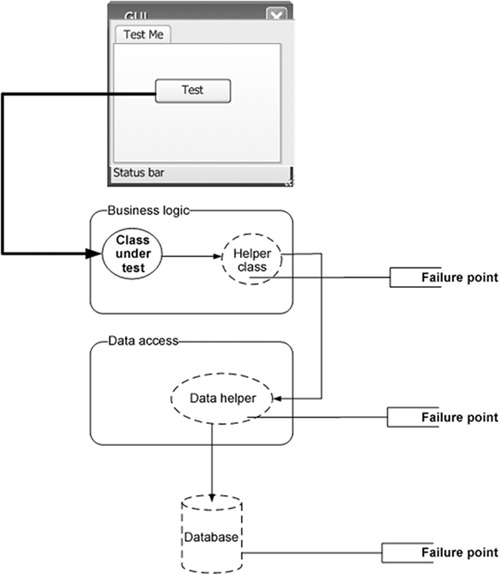
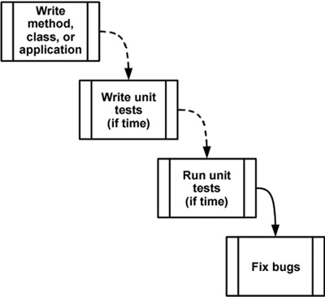
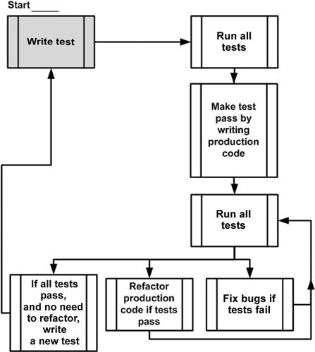

## 第一章

### 单元测试入门


## 测试的分类

<span class="fragment"></span>

note: 单元测试：它测试最小的功能单元。从开发者的角度来看，它的重点是确保一个函数做它应该做的事情。因而它应该有极小的或不依赖于其他作用/类。它应该在内存中完成，这意味着它不应该连接到数据库、访问网络或使用文件系统等等。单元测试应尽可能简单。
集成测试：它结合了代码单元和测试组合的工作正常。它是建立在单元测试之上的，它能够捕获我们无法通过单元测试发现的 bug。因为集成测试检查类 A 是否与 B 类一起工作。
系统测试：创建模拟真实生活环境中的实时场景。它是建立在集成测试之上的。集成测试确保系统的不同部分协同工作。系统测试确保整个系统在将其发送到验收测试之前按用户预期工作。
验收测试：当上面的测试是开发阶段的开发人员。验收测试实际上是由软件的用户完成的。用户不关心软件的内部细节。他们只关心软件是如何工作的。


## 单元测试 Unit testing

- <span class="fragment">在计算机编程中，单元测试是一种软件测试方法，它通过测试单个源代码单元、一个或多个计算机程序模块的集合以及相关的控制数据、使用过程和操作过程来确定是否适合使用。</span>


### 集成测试 Integration Testing

- <span class="fragment">集成测试（有时称为集成和测试）是软件测试中的阶段，其中单个软件模块被组合并作为一个组进行测试。它发生在单元测试和验证测试之前。集成测试作为其输入模块进行了单元测试，将它们分组在更大的聚合中，将集成测试计划中定义的测试应用于这些聚合，并将其输出为系统测试准备就绪的集成系统。</span>


### 系统测试 System testing

- <span class="fragment" style="font-size: 0.8em;">软件或硬件的系统测试是在一个完整的集成系统上进行测试，以评估系统是否符合其特定要求。系统测试属于黑盒测试的范围，因此，不应要求了解代码或逻辑的内部设计。</span>
- <span class="fragment" style="font-size: 0.8em;">通常，系统测试作为其输入，将所有通过集成测试的“集成”软件组件以及软件系统本身与任何适用的硬件系统集成在一起。集成测试的目的是检测集成在一起的软件单元（称为组合）或任何组合和硬件之间的不一致。系统测试是一种比较有限的测试类型；它寻求在“相互组合”和整个系统内检测缺陷。</span>


### 验收测试 Acceptance testing

- <span class="fragment" style="font-size: 0.7em;">在工程及其各种分支，验收测试是一个测试，以确定是否满足规范或合同的要求。它可能涉及化学测试、物理测试或性能测试。</span>
- <span class="fragment" style="font-size: 0.7em;">在系统工程中，它可能涉及对系统执行的黑盒测试（例如：一件软件，大量制造的机械零件，或批次的化工产品）交付之前。</span>
- <span class="fragment" style="font-size: 0.7em;">在软件测试中，ISTQB定义接受为：针对用户需求、要求和业务流程进行的正式测试，以确定系统是否满足验收标准，并使用户、客户或其他授权实体来确定是否接受系统。验收测试也称为用户验收测试（UAT)、最终用户测试、操作验收测试（OAT）或现场（验收）测试。</span>


## 单元测试的定义1.0

> 一个单元测试是一段代码（通常是一个方法），这段代码调用另一段代码，然后**检验某些假设的正确性**。如果这些假设是错误的，单元测试就失败了。一个单元可以是**一个方法或函数**。


### 单元测试示例

```php
// tests/Calculator1Test.php
class Calculator1Test extends TestCase
{
    public function testAdd_AssertEquals()
    {
        $calculator = new Calculator1;
        $sum = $calculator->add(18.1, 11.8);
        $this->assertEquals($sum, 29.9);
    }

    public function testAdd_AssertTrue()
    {
        $calculator = new Calculator1;
        $sum = $calculator->add(18.1, 11.8);
        $this->assertTrue($sum == 29.9);
    }
}
```


### 以下哪个选项是一个单元？

- 单点登录系统
- 用户在登录页面上输入用户名、密码后，点击登录后的处理程序
- 验证用户名、密码是否匹配的方法


### 定义一个单元取决于观察的位置

<video data-autoplay src="media/media1.mp4"></video>


## 一个单元的定义
- <span style="font-size: 0.6em;">从调用系统的一个公共方法到产生**一个测试可见的最终结果**，其间这个系统发生的行为总称为一个工作单元。我们通过系统的公共API和行为就可以观察到一个可见的最终结果，无需查看系统的内部状态。一个最终结果可以是**以下任何一种形式**。</span>
    - <span style="font-size: 0.6em;">被调用的公共方法返回一个值（一个返回值不为空的函数）</span>
    - <span style="font-size: 0.6em;">在方法调用的前后，系统的状态或行为有可见的变化，这种变化无需查询私有状态即可判断。（例如：一个以前不存在的用户可以登录系统，或者一个状态机系统的属性发生变化。）</span>
    - <span style="font-size: 0.6em;">调用了一个不受测试控制的第三方系统，这个第三方系统不返回任何值，或者返回值都被忽略。（例如：调用一个第三方日志系统，这个系统不是你编写的，而且你也没有源代码。）</span>


### 单元测试的定义1.1

> 一个单元测试是一段代码，这段代码调用一个工作单元，并检验该工作单元的**一个具体的最终结果**。如果关于这个最终结果的假设是错误的，单元测试就失败了。一个单元测试的范围可以小到一个方法，大到多个类。


### 我们都写过（某种）单元测试



note: 在传统测试中，开发人员使用一个图形用户界面（GUI）触发要测试的类的某个行为，然后检验结果


### 单元测试的特征

- <span style="font-size: 0.6em;">它应该是自动化的，可重复执行；</span>
- <span style="font-size: 0.6em;">它应该很容易实现；</span>
- <span style="font-size: 0.6em;">它应该第二天还有意义；</span>
- <span style="font-size: 0.6em;">任何人都应该能一键运行它；</span>
- <span style="font-size: 0.6em;">它应该运行速度很快；</span>
- <span style="font-size: 0.6em;">它的结果应该是稳定的（如果运行直接没有进行修改的话，多次运行一个测试应该总是返回同样的结果）；</span>
- <span style="font-size: 0.6em;">它应该能完全隔离的（独立于其他测试的运行）；</span>
- <span style="font-size: 0.6em;">如果它失败了，我们应该很容易发现什么是期待的结果，进而定位问题所在。</span>


### 单元测试的鉴别

- 我两周前写的一个单元测试，今天还能运行并得到结果吗？几个月前写的呢？几年前写的呢？
- 我两个月前写的单元测试，我团队里任何一个都能运行它们并得到结果吗？
- 我能在几分钟内跑完我写过的所有单元测试吗？
- 我能一键运行我写过的所有单元测试吗？
- 我能在几分钟内写出一个基本的测试吗？


## 单元测试实施案例

- <span style="font-size: 0.5em;">我工作过的最失败的一个项目就使用了单元测试。或者说，我是这么认为的。那时我带领着一队程序员开发一个记账应用，采取的是彻底的测试驱动开发方式：编写测试，然后编写代码；看到测试失败，使测试通过，重构代码；然后再开始新一轮过程。</span>
- <span style="font-size: 0.5em;">项目前期的几个月非常好，所有的事情都很顺利，我们有测试可以证明代码工作正常。但是随着时间的推移，需求发生了变化。我们被迫修改代码以适应新的需求，但是这样一来，测试失败了，需要修复。产品代码还是可以正常工作的，但是我们编写的测试过于脆弱，代码中任何微小的改变都会导致测试失败，哪怕代码工作正常。修改类或方法中的代码成了一项令人生畏的任务，因为同时还需要修复所有相关的单元测试。</span>
- <span style="font-size: 0.5em;">更糟糕的是，因为有些人离开了这个项目，没有人知道他们测试的是什么，也不知道如何维护他们的测试，这些测试就无法使用了。我们给单元测试方法起的名字不够清楚，还有的测试互相依赖。最后的结果是，项目才开始不到6个月，我们就扔掉了大部分的测试。</span>


## 讨论

这个案例中，失败的原因有哪些？


### 集成测试



note: 集成测试中可能有很多失败点。所有的单元要一起工作，而每个单元都有可能出错，因此找到缺陷的根源就更加困难


### 集成测试的定义

> 集成测试是对一个工作单元进行的测试，这个测试对被测试的工作单元没有完全的控制，并使用该单元的一个或多个真实依赖物，例如时间、网络、数据库、线程或随机数产生器等。


### 单元测试的定义1.2

> 一个单元测试是一段自动化的代码，这段代码调用被测试的工作单元，之后对这个单元的单个最终结果的某些假设进行检验。单元测试几乎都是用单元测试框架编写的。单元测试容易编写，能快速运行。单元测试**可靠、可读，并且可维护**。只要产品代码不发生变化，单元测试的**结果是稳定的**。


### 单元测试的收益

<!-- 不再长时间调试代码
对自己完成的工作很有信心
有更多的时间做其他事情 -->
- 提升代码质量。监督开发人员写出更加易于测试和可维护的代码。
- 提升开发团队内部的协作效率。其他开发人员可以通过阅读单元测试用例来理解代码原作者的意图。
- 保证功能实现的长期稳定。代码一旦发生与原功能意图不相符的变化，通过跑单元测试可以体现出来，即可以防止功能被无意识地破坏。
- 提高自动化测试占比，降低其他测试方式上的投入。


### 单元测试的收益

- 监测软件质量
- 提升项目效率
- 促进代码优化
- 增加重构自信
- 软件行为文档化

note: 尽早地发现问题
易于修改甚至重构
简化集成
可作为文档
符合设计规范


### 单元测试的挑战

- 难以单元测试的代码，开发人员需重新审视需求和功能的设计
- 要求开发者以调用者而不是实现者的角度来设计代码，利于代码之间的解耦


### 如何编写单元测试

```php
session_start();
if ($_SESSION['name']) {
    echo 'Hello, ' . $_SESSION['name'];
} else {
    echo 'Hello, Guest';
}
```


### 识别不可测试的代码

- <span style="font-size: 0.8em;">关于代码库不可测试性的问题域通常在编写代码时是不明显的。当编写 PHP 应用程序代码时，人们倾向于按照 Web 请求的流程来编写代码，这通常就是在应用程序设计时采用一种更加流程化的方法。急于完成项目或快速修复应用程序都可能促使开发人员 “走捷径”，以便快速完成编码。以前，编写不当或者混乱的代码可能会加重应用程序中的不可测试性问题，因为开发人员通常会进行风险最小的修复，即使它可能产生后续的支持问题。这些问题域都是无法通过一般的单元测试发现的。</span>

note: https://www.ibm.com/developerworks/cn/opensource/os-refactoringphp/index.html


### 解决方法：面向对象开发

```php
// src/Greeting.php
class Greeting
{
    /**
     * Get the greeting text.
     * 
     * @param string $name
     *
     * @return string
     */
    public function getText($name)
    {
        return 'Hello, ' . ($name ?: 'Guest');
    }
}
```


## 编写单元测试

```php
// tests/GreetingTest.php
class GreetingTest extends TestCase
{
    public function testGreetingWithName()
    {
        $greeting = new Greeting;
        $displayText = $greeting->getText('James');
        $this->assertEquals($displayText, 'Hello, James');
    }

    public function testGreetingWithoutName()
    {
        $greeting = new Greeting;
        $displayText = $greeting->getText(null);
        $this->assertEquals($displayText, 'Hello, Guest');
    }
}
```

note: https://github.com/Go-SQL-Driver/MySQL/#usage


### 被测试代码示例

```php
// src/Calculator1.php
class Calculator1
{
    /**
     * Add function.
     *
     * @param float $a
     * @param float $b
     *
     * @return float
     */
    public function add($a, $b)
    {
        return $a + $b;
    }
}
```


### 编写单元测试

```php
// tests/Calculator1Test.php
class Calculator1Test extends TestCase
{
    public function testAdd_AssertEquals()
    {
        $calculator = new Calculator1;
        $sum = $calculator->add(18.1, 11.8);
        $this->assertEquals($sum, 29.9);
    }

    public function testAdd_AssertTrue()
    {
        $calculator = new Calculator1;
        $sum = $calculator->add(18.1, 11.8);
        $this->assertTrue($sum == 29.9);
    }
}
```


## 运行单元测试

```sh
/slides/phpunit-tutorial$ phpunit chapter1/tests/Calculator1Test
PHPUnit 6.5.14 by Sebastian Bergmann and contributors.

.F                                                                  2 / 2 (100%)

Time: 27 ms, Memory: 4.00MB

There was 1 failure:

1) PHPUnitTutorial\Chapter1\Tests\Calculator1Test::testAdd_AssertTrue
Failed asserting that false is true.

/app/chapter1/tests/Calculator1Test.php:21

FAILURES!
Tests: 2, Assertions: 2, Failures: 1.
```


### 修改代码使测试通过

```php
// src/Calculator2.php
class Calculator2
{
    /**
     * Add function.
     *
     * @param float $a
     * @param float $b
     *
     * @return float
     */
    public function add($a, $b)
    {
        return bcadd($a, $b, 2);
    }
}
```


## 运行修改后的单元测试

```sh
/slides/phpunit-tutorial$ phpunit chapter1/tests/Calculator2Test
PHPUnit 6.5.14 by Sebastian Bergmann and contributors.

..                                                                  2 / 2 (100%)

Time: 19 ms, Memory: 4.00MB

OK (2 tests, 2 assertions)
```


### 传统开发流程



note: 编写单元测试的传统方法。虚线表示人们认为是可选的行为


### 测试驱动开发



note: 测试驱动开发概要图。注意，这是一个螺旋式的过程：编写测试，编码，重构，编写下一个测试。这张图展示了TDD的增量特性：小步骤的积累得到高质量的最终结果


### 单元测试的问题

- 决策问题
- 不集成测试
- 组合问题
- 现实问题
- 记录保存
- 可持续的挑战
- 平台差异
- 外部工作


### 单元测试的误区

- <span style="font-size: 0.7em;">对单元测试存在的误解，如：单元测试属于测试工作，应该由测试人员来完成，所以单元测试不属于开发人员的职责范围。</span>
- <span style="font-size: 0.7em;">答：虽然单元测试虽然叫做“测试”，但实际属于开发范畴，应该由开发人员来做，而开发人员也能从中受益。</span>

- <span style="font-size: 0.7em;">没有真正意识到单元测试的收益，认为写单元测试太费时，不值得。</span>
- <span style="font-size: 0.7em;">答：在开发时越早发现bug，就能节省更多的时间，降低更多的风险。单元测试先期要编写测试用例，是需要多耗费些时间，但是后面的调试、自测，都可以通过单元测试处理，不用手工一遍又一遍处理。实际上总时间被减少了。</span>


### 参考资料


- https://github.com/sebastianbergmann/money
- https://github.com/moneyphp/money
- https://www.ibm.com/developerworks/cn/opensource/os-refactoringphp/index.html
- https://github.com/royosherove/aout2
- http://artofunittesting.com/storage/chapters/SampleChapter1.htm
