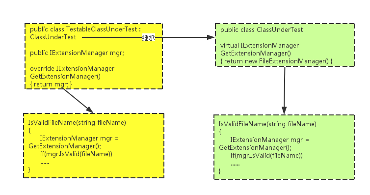

## 第三章

### 单元测试进阶——测试替身


## 测试替身的概念

- <span style="font-size: 0.9em;">有时候对被测系统(SUT)进行测试是很困难的，因为它依赖于其他无法在测试环境中使用的组件。这有可能是因为这些组件不可用，它们不会返回测试所需要的结果，或者执行它们会有不良副作用。在其他情况下，我们的测试策略要求对被测系统的内部行为有更多控制或更多可见性。</span>
- <span style="font-size: 0.9em;">如果在编写测试时无法使用（或选择不使用）实际的依赖组件(DOC)，可以用测试替身来代替。测试替身不需要和真正的依赖组件有完全一样的的行为方式；他只需要提供和真正的组件同样的 API 即可，这样被测系统就会以为它是真正的组件！</span>


## 设计模式

- 什么是开闭原则（ Open-Closed Principle）
- 什么是依赖注入（ Dependency Injection）
- 什么是控制反转（Inversion of Control）
- 什么是工厂模式


## 使用存根破除依赖

- 当我们要测试的对象依赖另一个你无法控制（或者还未实现）的对象。这个对象可能是Web服务、系统时间、线程调度或者很多其他东西。重要的问题是：你的测试代码不能控制这个依赖的对象向你的代码返回什么值，也不能控制它的行为（例如你想模拟一个异常）。这种情况下你可以使用存根。


## 存根简介

- 一个**外部依赖项（external dependency）**是系统中的一个对象，被测试代码与这个对象发生交互，但你不能控制这个对象。（常见的外部依赖项包括文件系统、线程、内存以及时间等。）
- 一个**存根（Stub）**是对系统中存在的一个依赖项（或者协作者）的可控制的替代物。通过使用存根，你在测试代码时无需直接处理这个依赖项。


## 发现项目中的外部依赖

- LogAnalyzer类的应用程序可以配置成处理多个日志文件扩展名，每种文件使用一个特殊的适配器。为简单起见，我们可以假设程序支持的各种文件名作为应用程序的配置文件存放在磁盘的某个地方，IsValidLogFileName方法如下所示：

```php
public bool IsValidLogFileName(string fileName)
{
    // 读取配置文件
    // 如果配置文件说支持这个扩展名，返回true
}
```


## 抑制测试设计


- <span style="font-size: 0.6em;">如图所示，这种设计带来的问题：一旦测试依赖于文件系统，你进行的就是集成测试，带来了所有与集成测试相关的问题——运行速度较慢，需要配置，一次测试多个内容，等等。</span>
- <span style="font-size: 0.6em;">这就是抑制测试（test-inhibiting）设计的实质：代码对一个外部资源有种依赖，尽管代码本身的逻辑是完全正确的，但是这种外部依赖可能导致测试失败。在遗留系统中，一个工作单元（系统中的一个操作）可能对外部资源有很多依赖，而你的测试代码对这些外部资源基本上无法控制。</span>


## 避免项目中的直接依赖

- 想要破除直接依赖，可以参考以下两个步骤：
    1. 找到被测试对象使用的外部接口或者API
    2. 把这个接口的底层实现替换成你能控制的东西


## 引入间接层来避免文件系统依赖

- <span style="font-size: 0.3em;">对于我们的LogAn项目，我们要做到替代实例不会访问文件系统，这样便破除了文件系统的依赖性。因此，我们可以引入一个间接层来避免对文件系统的直接依赖。访问文件系统的代码被隔离在一个FileExtensionManager类中，这个类之后将会被一个存根类替代，如下图所示：</span>


## 重构代码设计以提高可测试性

- <span style="font-size: 0.8em;">**重构（refactoring）**是在不改变代码功能的前提下对代码的修改。也就是说，代码在修改前后做的工作是完全相同的，既不多也不少，只是代码外观看起来不一样了。重构的例子有：重命名一个方法，或者把一个长方法拆成几个较短的方法。</span>
- <span style="font-size: 0.8em;">**接缝（seam）**是代码中可以插入不同功能的地方，这些功能包括使用存根类，添加一个构造函数参数，添加一个可设置的公共属性，把一个方法改成可以重写的虚拟方法，或者把一个委托外部化成一个参数或属性以便从类的外部赋值。代码设计的开闭原则（Open-Closed Principle）要求：类的功能是开放的，允许对其扩展；而源代码是封闭的，不可直接修改。遵循开闭原则，实现的代码中就会有接缝。</span>


## 两类打破依赖的重构方法

- A型和B型重构，二者互相依赖。
- A型 把具体类抽象成接口（interfaces）或委托（delegates）
- B型 重构代码，从而能够对其注入这种委托和接口的伪实现（fake implementation）。
- A型 抽取出一个接口，使底层实现可以替换。
- B型 在被测试类中注入一个存根实现。
- B型 在构造函数层次注入一个伪对象。
- B型 注入一个作为属性设置和读取的伪对象。
- B型 在一个方法调用前注入一个伪对象。


## 抽取接口使底层实现可替换

```php
// src/LogAnalyzer1.php
class LogAnalyzer1
{
    /**
     * 判断文件名是否有效
     *
     * @param string $filename
     *
     * @return bool
     */
    public function isValidLogFileName($filename)
    {
        $mgr = new FileExtensionManager();
        return $mgr->isValid($filename);
    }
}
```


## 抽取接口使底层实现可替换

```php
// src/FileExtensionManager.php
class FileExtensionManager implements IExtensionManager
{
    /**
     * 判断文件名是否有效
     *
     * @param string $filename
     *
     * @return bool
     */
    public function isValid($filename)
    {
        // 读取文件
    }
}
```


## 从一个已知的类抽取出一个接口

```php
// src/IExtensionManager.php
interface IExtensionManager
{
    /**
     * 判断文件名是否有效
     *
     * @param string $filename
     *
     * @return bool
     */
    public function isValid($filename);
}
```


## 总是返回true的简单存根代码

```php
// src/AlwaysValidFakeFileExtensionManager.php
class AlwaysValidFakeFileExtensionManager implements IExtensionManager
{
    /**
     * 判断文件名是否有效
     *
     * @param string $filename
     *
     * @return bool
     */
    public function isValid($filename)
    {
        return true;
    }
}
```


## 依赖注入：在被测试单元中注入一个伪实现

- <span style="font-size: 0.5em;">通过基于接口的接缝，你可以在类中注入一个接口的实现，让类的方法使用这种接口实现。这里有几种在代码中创建基于接口的接缝的可行方法，以下是其中最值得注意的几个。</span>
- <span style="font-size: 0.5em;">在构造函数的层次得到一个接口，把这个接口保存在一个字段中供以后使用。</span>
- <span style="font-size: 0.5em;">以属性读取或设置的方式得到一个接口，把这个接口保留字一个字段中供以后使用。</span>
- <span style="font-size: 0.5em;">使用以下方法之一在被测试方法调用之前获得一个接口：</span>
    - <span style="font-size: 0.5em;">方法的参数（参数注入）</span>
    - <span style="font-size: 0.5em;">工厂类</span>
    - <span style="font-size: 0.5em;">本地工厂方法</span>
    - <span style="font-size: 0.5em;">前面几种技术的变种</span>


## 通过构造函数注入伪对象


## 在构造函数层注入一个伪对象（构造函数注入）

```php
// src/LogAnalyzer2.php
class LogAnalyzer2
{
    /*
     * @var IExtensionManager
     */
    private $manager;

    /**
     * 构造函数
     *
     * @param IExtensionManager $mgr
     */
    public function __construct(IExtensionManager $mgr)
    {
        $this->manager = $mgr;
    }

    /**
     * 判断文件名是否有效
     *
     * @param string $filename
     *
     * @return bool
     */
    public function isValidLogFileName($filename)
    {
        return $this->manager->isValid($filename);
    }
}
```


## 用伪对象模拟返回值

```php
// src/FakeExtensionManager1.php
class FakeExtensionManager1 implements IExtensionManager
{
    /**
     * @var bool
     */
    public $willBeValid = false;

    /**
     * 判断文件名是否有效
     *
     * @param string $filename
     *
     * @return bool
     */
    public function isValid($filename)
    {
        return $this->willBeValid;
    }
}
```


## 编写单元测试

```php
// tests/LogAnalyzer2Test.php
class LogAnalyzer2Test extends TestCase
{
    public function testIsValidLogFileName_NameSupportedExtension_ReturnsTrue()
    {
        // 设置要使用的存根，确保其返回true
        $stub = new FakeExtensionManager1();
        $stub->willBeValid = true;
        // 创建logan，注入存根
        $logan = new LogAnalyzer2($stub);
        // 假设扩展名受支持的断言逻辑
        $result = $logan->isValidLogFileName("foobar.ext");
        $this->assertTrue($result);
    }
}
```


## 关于构造函数注入的警告

```php
// src/LogAnalyzer2Warning.php
class LogAnalyzer2Warning
{
    /*
     * @var IExtensionManager
     */
    private $manager;

    /*
     * @var ILog
     */
    private $log;

    /*
     * @var IWebService
     */
    private $svc;

    /**
     * 假设除了文件扩展名管理器，LogAnalyzer还依赖一个Web服务和一个日志服务，构造函数就可能变成这样
     *
     * @param IExtensionManager $mgr
     * @param ILog              $logger
     * @param IWebService       $service
     */
    public function __construct(IExtensionManager $mgr, ILog $logger, IWebService $service)
    {
        $this->manager = $mgr;
        $this->log = $logger;
        $this->svc = $service;
    }
}
```


## 解决方案讨论

- <span style="font-size: 0.5em;">解决这个问题的一种方案是创建一个特殊的类，包含初始化一个类所需的所有值。构造函数只有一个参数：这个特殊类。这样的话，你只需要传递一个包含所有相关依赖项的对象。这种方法也称为参数对象重构（Parameter object Refactoring）。</span>
- <span style="font-size: 0.5em;">另一个方案是使用控制反转（Inversion of Control，IoC）容器。你可以把控制反转容器看做生产对象的“智能工厂”（尽管它们的作用远不止如此）。这些容器提供特殊的工厂方法，接受你要创建的对象类型以及所需的任何依赖项，使用特殊的可配值规则初始化所需的对象，如调用什么构造函数，按什么顺序设置什么属性，等等。如果在一个复杂的组合对象层次结构中，创建一个对象需要创建和初始化其下若干层的对象，控制反转容器就非常有用。举个例子，如果你的类的构造函数需要一个ILogger接口，你可以配置一个容器对象，每次在满足这个ILogger接口请求时都返回你传入的那个ILogger对象。使用容器通常能简化对象的处理和获取，还能减少对依赖项或者维护构造函数的担心。</span>


## 什么时候应该使用构造函数注入

- 除非使用类似IoC容器的帮助框架来创建对象，使用构造函数参数来初始化对象会使测试代码变得笨拙。但是和其他依赖注入的方法相比，我还是愿意使用构造函数注入，因为在API的可读性和可理解性方面，构造函数注入带来的影响是最小的。
- 另外，如果想告诉API使用者某些参数是必须的，在构造函数中使用这些参数是一个极好的办法。这些参数必须在创建对象时传入。


## 用伪对象模拟异常

```php
// src/FakeExtensionManager2.php
class FakeExtensionManager2 implements IExtensionManager
{
    /**
     * @var bool
     */
    public $willBeValid = false;

    /**
     * @var Exception
     */
    public $willThrow;

    /**
     * 判断文件名是否有效
     *
     * @param string $filename
     *
     * @return bool
     */
    public function isValid($filename)
    {
        if ($this->willThrow) {
            throw $this->willThrow;
        }
        return $this->willBeValid;
    }
}
```


## 编写单元测试

```php
// tests/LogAnalyzer3Test.php
class LogAnalyzer3Test extends TestCase
{
    public function testIsValidLogFileName_ExtManagerThrowsException_ReturnsFalse()
    {
        // 设置要使用的存根，使其抛出异常
        $stub = new FakeExtensionManager2();
        $stub->willThrow = new Exception("Fake exception");
        // 创建logan，注入存根
        $logan = new LogAnalyzer3($stub);
        // 假设扩展名受支持的断言逻辑
        $result = $logan->isValidLogFileName("foo.bar");
        $this->assertFalse($result);
    }
}
```


## 通过属性设置注入伪对象


## 用属性get或set注入伪对象

```php
// src/LogAnalyzer4.php
class LogAnalyzer4
{
    /*
     * @var IExtensionManager
     */
    public $manager;

    /**
     * 构造函数
     */
    public function __construct()
    {
        $this->manager = new FileExtensionManager();
    }

    /**
     * 判断文件名是否有效
     *
     * @param string $filename
     *
     * @return bool
     */
    public function isValidLogFileName($filename)
    {
        return $this->manager->isValid($filename);
    }
}
```


## 编写单元测试

```php
// tests/LogAnalyzer4Test.php
class LogAnalyzer4Test extends TestCase
{
    public function testIsValidLogFileName_SupportedExtension_ReturnsTrue()
    {
        // 设置要使用的存根，确保其返回true
        $stub = new FakeExtensionManager1();
        $stub->willBeValid = true;
        // 创建logan，注入存根
        $logan = new LogAnalyzer4($stub);
        $logan->manager = $stub;
        // 假设扩展名受支持的断言逻辑
        $result = $logan->isValidLogFileName("foobar.ext");
        $this->assertTrue($result);
    }
}
```


## 属性注入依赖

- 使用属性注入依赖。这种方法比使用构造函数简单，因为每个测试可以只设置自己需要的属性。
- 和构造函数注入一样，属性注入也定义了哪些依赖项是必需的，哪些是可选的，因此影响到API设计。通过使用属性，你实际上是在声明：“要操作这种类型，这个依赖项不是必需的。”
- 什么时候应该使用属性注入
    - 如果你想表明被测试类的某个依赖项是可选的，或者测试可以放心使用默认创建的这个依赖项实例，就可以使用属性注入。


## 在方法调用前注入伪对象

- 这一节讨论的场景是：你在对一个对象进行操作之前才能得到其实例，而不是通过构造函数或者属性得到。这种情况的不同之处在于发起存根请求的对象是被测试代码。而在之前几节中，那些伪对象是在测试开始之前，由被测试代码之外的代码设置的。


## 使用一个工厂类

```php
// src/ExtensionManagerFactory.php
class ExtensionManagerFactory
{
    /**
     * @var IExtensionManager
     */
    private static $customManager;

    /**
     * 创建一个ExtensionManager
     *
     * @return IExtensionManager
     */
    public static function create()
    {
        if (self::$customManager) {
            return self::$customManager;
        }
        return new FileExtensionManager;
    }

    /**
     * 设置自定义ExtensionManager
     *
     * @param IExtensionManager $mgr
     *
     * @return void
     */
    public static function setManager(IExtensionManager $mgr)
    {
        self::$customManager = $mgr;
    }
}
```


## 在测试运行时设置工厂类返回一个存根

```php
// src/LogAnalyzer5.php
class LogAnalyzer5
{
    /*
     * @var IExtensionManager
     */
    private $manager;

    /**
     * 构造函数
     */
    public function __construct()
    {
        $this->manager = ExtensionManagerFactory::create();
    }

    /**
     * 判断文件名是否有效
     *
     * @param string $filename
     *
     * @return bool
     */
    public function isValidLogFileName($filename)
    {
        return $this->manager->isValid($filename);
    }
}
```


## 编写单元测试

```php
// tests/LogAnalyzer5Test.php
class LogAnalyzer5Test extends TestCase
{
    public function testIsValidLogFileName_SupportedExtension_ReturnsTrue()
    {
        // 设置要使用的存根，确保其返回true
        $stub = new FakeExtensionManager1();
        $stub->willBeValid = true;
        ExtensionManagerFactory::setManager($stub);
        // 假设扩展名受支持的断言逻辑
        $logan = new LogAnalyzer5();
        $result = $logan->isValidLogFileName("foobar.ext");
        $this->assertTrue($result);
    }
}
```


## 可以伪造的代码层次

| 被测试代码 | 可进行的操作 |
| -------- | -------- |
| 层次深度1：类中的FileExtensionManager | <span style="font-size: 0.7em;">添加一个用作依赖项的构造函数参数。被测试类中的一个成员是伪造的，其他代码都保持不变<span> |
| 层次深度2：从工厂类返回给被测试代码的依赖项 | <span style="font-size: 0.7em;">通过设置工厂类的属性，让工厂类返回你伪造的依赖项。工厂类中的成员是伪造的，被测试类不变<span> |
| 层次深度3：返回依赖项的工厂类 | <span style="font-size: 0.7em;">把工厂类实例替换为返回伪造依赖项的伪工厂。工厂是伪造的，并且返回一个伪依赖。被测试类不变<span> |


## 伪造方法——使用一个局部的工厂方法（抽取和重写）




## 在被测试类中：

- 添加一个返回真实实例的虚工厂方法
- 正常的在代码中使用工厂方法


## 在测试代码中：

- 创建一个新类
- 声明这个新类继承被测试类
- 创建一个你要替换的接口（IExtensionManager）类型的公共字段
- 重写虚工厂方法
- 返回公共字段


## 在测试类中：

- 创建一个存根类的实例，此存根类实现了所要求的接口（IExtensionManager）
- 创建新派生类而非被测类的实例
- 配置这个新实例的公共字段，设置成你在测试中创建的存根实例


## 抽取和重写

```php
// src/LogAnalyzer6.php
class LogAnalyzer6
{
    /**
     * 判断文件名是否有效
     *
     * @param string $filename
     *
     * @return bool
     */
    public function isValidLogFileName($filename)
    {
        return $this->getManager()->isValid($filename);
    }

    /**
     * 获取文件扩展名管理器
     *
     * @return IExtensionManager
     */
    protected function getManager()
    {
        return new FileExtensionManager();
    }
}
```


## 重写可测试的TestableLogAnalyzer6

```php
// src/TestableLogAnalyzer6.php
class TestableLogAnalyzer6 extends LogAnalyzer6
{
    /*
     * @var IExtensionManager
     */
    private $manager;

    /**
     * 构造函数
     *
     * @param IExtensionManager $mgr
     */
    public function __construct(IExtensionManager $mgr)
    {
        $this->manager = $mgr;
    }

    /**
     * 获取文件扩展名管理器
     *
     * @return IExtensionManager
     */
    protected function getManager()
    {
        return $this->manager;
    }
}
```


## 编写单元测试

```php
// tests/LogAnalyzer6Test.php
class LogAnalyzer6Test extends TestCase
{
    public function testOverrideTest()
    {
        // 设置要使用的存根，确保其返回true
        $stub = new FakeExtensionManager1();
        $stub->willBeValid = true;
        // 创建logan，注入存根
        $logan = new TestableLogAnalyzer6($stub);
        // 假设扩展名受支持的断言逻辑
        $result = $logan->isValidLogFileName("foobar.ext");
        $this->assertTrue($result);
    }
}
```


## 什么时候应使用这种方法

- <span style="font-size: 0.7em;">抽取和重写是一种强大的技术，因为它使你无需进入更深层次（改变调用栈深处的依赖）即可直接替换依赖项，实现起来快速干净，几乎影响了你对面向对象的美好感觉，导致你编写更少的接口、更多的虚函数。</span>
- <span style="font-size: 0.7em;">抽取和重写非常适合用来模拟提供给被测试代码的输入，但是如果用来验证从被测试代码到依赖项的调用却十分不便。</span>
- <span style="font-size: 0.7em;">例如，如果测试代码调用一个Web服务，得到一个返回值，你想要模拟自己的返回值，使用抽取和重写很好。但是如果你想测试代码对Web服务的调用是否正确，事情很快就变糟了。这需要大量的手工编码，而隔离框架更适合做这样的工作。如果你要模拟返回值或者整个返回接口，抽取和重写都很合适，但是要检查对象之间的交互，这种方法就不适用了。</span>


## 重构技术变种

```php
// src/LogAnalyzer7.php
class LogAnalyzer7
{
    /**
     * 判断文件名是否有效
     *
     * @param string $filename
     *
     * @return bool
     */
    public function isValidLogFileName($filename)
    {
        return $this->isValid($filename);
    }

    /**
     * 判断文件名是否有效
     *
     * @param string $filename
     *
     * @return bool
     */
    public function isValid($filename)
    {
        $mgr = new FileExtensionManager();
        return $mgr->isValid($filename);
    }
}
```


## 重写可测试的TestableLogAnalyzer7

```php
// src/TestableLogAnalyzer7.php
class TestableLogAnalyzer7 extends LogAnalyzer7
{
    /**
     * @var bool
     */
    public $isSupported = false;

    /**
     * 判断文件名是否有效
     *
     * @param string $filename
     *
     * @return bool
     */
    public function isValid($filename)
    {
        return $this->isSupported;
    }
}
```


## 编写单元测试

```php
// tests/LogAnalyzer7Test.php
class LogAnalyzer7Test extends TestCase
{
    public function testOverrideTestWithoutStub()
    {
        $logan = new TestableLogAnalyzer7();
        $logan->isSupported = true;
        // 假设扩展名受支持的断言逻辑
        $result = $logan->isValidLogFileName("foobar.ext");
        $this->assertTrue($result);
    }
}
```


## 克服封装问题

- <span style="font-size: 0.7em;">有些人觉得开放代码设计，进行重构使其更易测试是一件坏事，因为这种做法破坏了设计遵循的面向对象原则。面向对象技术的存在是为了限制API的最终用户（最终用户是使用你编写的对象模型的程序员）的行为，使对象模型能得到正确的使用，避免误用。面向对象也和代码重用以及单一职责原则（这个原则要求每个类只有一个职责）密切相关。</span>
- <span style="font-size: 0.7em;">在为代码编写单元测试的时候，你给这个对象模型增加了另一个最终用户（测试）。这个最终用户和原本那个最终用户同样重要，但是使用模型时，它们的目的不同。测试对对象模型有着特定的需求，这些需求看似违背了若干面向对象原则的基本逻辑，尤其是封装原则。封装外部依赖项，不允许修改，使用私有构造函数或密封类，使用不能重写的非虚方法，所有这些都是过度保护设计的经典特征。</span>


## 使用模拟对象进行交互测试

- <span style="font-size: 0.6em;">前面解决了依赖其他对象才能正确运行的代码的测试问题。我们利用存根，使被测试代码可以得到所有需要的输入，独立地测试了代码的逻辑。</span>
- <span style="font-size: 0.6em;">工作单元可能有三种最终结果，目前为止你编写过的测试只针对前两种：返回值和改变系统状态。</span>
- <span style="font-size: 0.6em;">现在我们要学习如何测试第三种最终结果——调用第三方对象。这里将检验一个对象是否正确地调用了其他对象。被测试的对象可能不会返回任何结果，或者保存任何状态，但是它有一套复杂的逻辑，需要正确地调用其他对象，而被调用的对象不受你的控制，或者不是被测试单元的一部分。你之前掌握的办法在这里都不适用，因为没有外部API可以检验被测对象内部是否发生了变化。那么怎样测试你的对象与其他对象进行了正确的交互呢？这时需要用到模拟对象。</span>


## 交互测试
- 交互测试是对一个对象如何向其他对象发送消息（调用方法）的测试。如果一个特定的工作单元的最终结果是调用另一个对象，你就需要进行交互测试。
- 请总是把交互测试作为最后的选择，这一点非常重要。你应该优先考虑能否使用前两种类型（基于值或基于状态）的测试，因为进行交互测试会让很多事情变得更复杂。


## 理解交互测试

- <span style="font-size: 0.5em;">假设有一个灌溉系统，你对这个系统如何灌溉庭院里的树进行了配置：一天浇几次，每次浇多少水。以下是测试灌溉系统是否正确工作的两个方法。</span>
- <span style="font-size: 0.5em;">**基于状态的集成测试** （是的，集成测试而非单元测试）让灌溉系统运行12小时，这期间它应该给树浇很多次水。这个时间段结束后，检查浇灌的树的状态，土壤是否足够潮湿，树是否健康，叶子是否青翠，等等。这个测试也许很难执行，但是只要能执行，你就知道灌溉系统是否工作正常。我把这个测试称为集成测试，因为它花费的时间很长，运行测试涉及灌溉系统周围的整个环境。</span>
- <span style="font-size: 0.5em;">**交互测试** 在每个水管末端，安装一个设备，记录什么时间多少水流过。在每天结束时，检查这个设备记录的次数是否正确，每次记录的水量是否正确，不用费心检查树的情况。实际上，你不需要树也能检查系统是否工作。你可以更进一步，修改灌溉单元上的系统时钟（使其成为一个存根），让系统以为灌溉时间已到，在你选择的任意时间进行灌溉。这样你无需等待（这个例子里是12小时）就能知道系统是否工作。</span>


## 理解交互测试

- <span style="font-size: 0.6em;">如你所见，在这种情况下，进行交互测试可以让生活变得更简单。</span>
- <span style="font-size: 0.6em;">但是有时，进行交互测试非常困难甚至无法实现，基于状态的测试是最好的选择。</span>
- <span style="font-size: 0.6em;">碰撞测试假人就是这种情况：一辆车以指定的速度撞击一个静止的目标，撞击之后，需要检查车和假人的状态获得测试结果。在实验室里以交互测试的方式进行这种试验过于复杂，因此还是需要进行基于状态的真实测试。</span>
- <span style="font-size: 0.6em;">现在让我们回到灌溉系统。那个记录灌溉信息的设备是什么呢？它是一个假的水龙头，你可以说它是一个存根。但这是一种更智能的存根——记录收到的调用的存根，你可以用它判断测试是否通过。这差不多就是模拟对象的定义。那个用来替换的假时钟呢？它是一个存根，因为它只是假装工作，模拟时间，让你更方便地测试系统的另外一部分。</span>


## 模拟对象

> 模拟对象是系统中的伪对象，它可以验证被测试对象是否按预期的方式调用了这个伪对象，因此导致单元测试通过或是失败。通常每个测试最多有一个模拟对象。


## 伪对象

> 伪对象是通用的术语，可以描述一个存根或者模拟对象（手工或非手工编写），因为存根和模拟对象看上去都很像真实对象。一个伪对象究竟是存根还是模拟对象取决于它在当前测试中的使用方式：如果这个伪对象用来检验一个交互（对其进行断言），它就是模拟对象，否则就是存根。


## 模拟对象和存根的区别


## 手工模拟对象的简单示例

- <span style="font-size: 0.8em;">创建和使用模拟对象的方法与使用存根类似，只是模拟对象比存根多做一件事：它保存通讯的历史记录，这些记录之后用于预期（expectation）验证。</span>
- <span style="font-size: 0.8em;">假设我们的被测试项目LogAnalyzer需要和一个外部的Web服务交互，每次LogAnalyzer遇到一个过短的文件名，这个Web服务就会收到一个错误消息。</span>
- <span style="font-size: 0.8em;">遗憾的是，要测试的这个Web服务还没有完全实现。就算实现了，使用这个Web服务会导致测试时间过长。因此，你需要重构设计，创建一个新接口，之后用这个接口创建模拟对象。这个接口只包括你需要调用的Web服务方法。</span>


## LogAnalyzer调用外部服务示例

```php
// src/LogAnalyzer8.php
class LogAnalyzer8
{
    /*
     * @var IWebService
     */
    private $service;

    /**
     * 构造函数
     *
     * @param IWebService $service
     */
    public function __construct(IWebService $service)
    {
        $this->service = $service;
    }

    /**
     * 分析日志文件
     *
     * @param string $filename
     *
     * @return void
     */
    public function analyze($filename)
    {
        if (strlen($filename) < 8) {
            // 在产品代码中写错误日志
            $this->service->logError("Filename too short: {$filename}");
        }
    }
}
```


## 外部服务接口

```php
// src/IWebService.php
interface IWebService
{
    /**
     * 记录错误日志
     *
     * @param string $message
     *
     * @return void
     */
    public function logError($message);
}
```


## 在测试中使用你的模拟对象


## 创建外部服务模拟对象

```php
// src/FakeWebService1.php
class FakeWebService1 implements IWebService
{
    /**
     * @var string
     */
    public $lastError;

    /**
     * 记录错误日志
     *
     * @param string $message
     *
     * @return void
     */
    public function logError($message)
    {
        $this->lastError = $message;
    }
}
```


## 使用模拟对象测试LogAnalyzer

```php
// tests/LogAnalyzer8Test1.php
class LogAnalyzer8Test1 extends TestCase
{
    public function testAnalyze_TooShortFileName_CallsWebService()
    {
        $mockService = new FakeWebService1();
        $logan = new LogAnalyzer8($mockService);
        $tooShortFileName = "abc.ext";
        $logan->analyze($tooShortFileName);
        // 对模拟对象进行断言
        $this->assertEquals("Filename too short: {$tooShortFileName}", $mockService->lastError);
    }
}
```


## 使用模拟对象测试的注意事项

- <span style="font-size: 0.7em;">请注意测试对模拟对象进行断言，而非LogAnalyer类，因为测试的是LogAnalyer和Web服务之间的交互。这里也使用了依赖注入（DI）技术，但是这一次模拟对象（而非存根）还能决定测试通过或者失败。</span>
- <span style="font-size: 0.7em;">还有一点要注意：断言不是直接写在模拟对象内部的。原因列举如下：</span>
    - <span style="font-size: 0.7em;">你希望其他测试用例能够使用别的断言，重用这个模拟对象。</span>
    - <span style="font-size: 0.7em;">如果断言写在手工编写的伪造类内部，那么读测试代码的人不能看到断言具体是什么。这种做法对测试代码隐藏了关键信息，降低了测试的可读性与可维护性。</span>
- <span style="font-size: 0.7em;">一个测试有多个存根是完全可行的，但是有多个模拟对象就会产生麻烦，因为多个模拟对象说明你同时测试了多个事情。</span>


## 同时使用模拟对象和存根

```php
// src/LogAnalyzer9.php
class LogAnalyzer9
{
    /*
     * @var IWebService
     */
    private $service;

    /*
     * @var IEmailService
     */
    private $email;

    /**
     * 构造函数
     *
     * @param IWebService $service
     */
    public function __construct(IWebService $service, IEmailService $email)
    {
        $this->service = $service;
        $this->email = $email;
    }

    /**
     * 分析日志文件
     *
     * @param string $filename
     *
     * @return void
     */
    public function analyze($filename)
    {
        if (strlen($filename) < 8) {
            try {
                $this->service->logError("Filename too short: {$filename}");
            } catch (Exception $e) {
                $this->email->sendEmail("john.doe@domain.tld", "Log failed", $e->getMessage());
            }
        }
    }
}
```


## 电子邮件服务接口

```php
// src/IEmailService.php
interface IEmailService
{
    /**
     * 发送电子邮件
     *
     * @param string $to
     * @param string $subject
     * @param string $body
     *
     * @return void
     */
    public function sendEmail($to, $subject, $body);
}
```


## 测试的问题

- 请注意代码里只包含调用外部对象的逻辑，既没有返回值，也没有系统状态改变，那么我们怎么测试当Web服务抛出异常时LogAnalyzer正确地调用了电子邮件服务呢？
    - 如何替换Web服务？
    - 如何模拟来自Web服务的异常，以测试对电子邮件服务的调用？
    - 如何判断电子邮件服务调用是否正确，或者调用是否发生？


## 解决方案


## 创建外部服务伪对象

```php
// src/FakeWebService2.php
class FakeWebService2 implements IWebService
{
    /**
     * @var Exception
     */
    public $toThrow;

    /**
     * 记录错误日志
     *
     * @param string $message
     *
     * @return void
     */
    public function logError($message)
    {
        if ($this->toThrow) {
            throw $this->toThrow;
        }
    }
}
```


## 创建电子邮件服务模拟对象

```php
// src/FakeEmailService.php
class FakeEmailService implements IEmailService
{
    /**
     * @var string
     */
    public $to;

    /**
     * @var string
     */
    public $subject;

    /**
     * @var string
     */
    public $body;

    /**
     * 发送电子邮件
     *
     * @param string $to
     * @param string $subject
     * @param string $body
     *
     * @return void
     */
    public function sendEmail($to, $subject, $body)
    {
        $this->to = $to;
        $this->subject = $subject;
        $this->body = $body;
    }
}
```


## 使用模拟对象和存根测试LogAnalyzer

```php
// tests/LogAnalyzer9Test.php
class LogAnalyzer9Test extends TestCase
{
    public function testAnalyze_TooShortFileName_CallsWebService()
    {
        $stubService = new FakeWebService2();
        $stubService->toThrow = new Exception("Fake exception");
        $mockEmail = new FakeEmailService();
        $logan = new LogAnalyzer9($stubService, $mockEmail);
        $tooShortFileName = "abc.ext";
        $logan->analyze($tooShortFileName);
        // 对模拟对象进行断言
        $this->assertEquals("john.doe@domain.tld", $mockEmail->to);
        $this->assertEquals("Log failed", $mockEmail->subject);
        $this->assertEquals("Fake exception", $mockEmail->body);
    }
}
```


## 过度指定

- <span style="font-size: 0.7em;">如果一个测试只测试一件事情，测试中应该最多只有一个模拟对象。所有其他的伪对象都是存根。如果一个测试有多个模拟对象，这说明你在测试多件事情，会导致测试过于复杂或脆弱。</span>
- <span style="font-size: 0.7em;">遵循上面这个原则，在碰到更复杂的测试时，你可以问问自己：“哪个是我的模拟对象呢？”一旦确定了模拟对象，你可以把其他的伪对象都用作存根，不对它们断言。（如果你发现测试对一些伪对象进行了断言，而这些伪对象明显是用作存根的，要小心。这是过度指定的迹象。）</span>
- <span style="font-size: 0.7em;">过度指定（overspecification）是过多地指定测试中应该发生的事情的行为，而这些事情实际上对测试无关紧要。例如，代码调用了存根。</span>


## 过度指定

- <span style="font-size: 0.7em;">这些额外的指定可能导致测试因为错误的原因失败：你修改了产品代码，改变它的工作方式，尽管代码的最终结果还是正确的，测试却开始冲你尖叫：“我失败了！你说要调用这个方法的！你根本没调用！”</span>
- <span style="font-size: 0.7em;">然后你就经常为了适应产品代码的内部实现而修改测试代码——最终你终于厌倦了，问自己：“为什么我老是在干这个？”然后你就开始删除测试。</span>
- <span style="font-size: 0.7em;">游戏到此结束。</span>
- <span style="font-size: 0.7em;">一个测试只能指定工作单元三种最终结果中的一个，不然的话天下大乱，你会死得很难看。不要说我没警告过你。</span>


## 手工模拟对象和存根的问题

- <span style="font-size: 0.7em;">编写模拟对象和存根需要花费时间。</span>
- <span style="font-size: 0.7em;">如果类和接口有许多方法、属性或事件，就很难为它编写存根和模拟对象。</span>
- <span style="font-size: 0.7em;">要保存模拟对象多次调用的状态，你需要在手工伪实现里写许多标准代码。</span>
- <span style="font-size: 0.7em;">如果要验证调用者向一个方法调用传递的所有参数都是正确的，需要写多个断言，非常笨拙。</span>
- <span style="font-size: 0.7em;">难以在其他测试中重用模拟对象和存根代码。基本代码还能用，但是一旦接口有超过两三个方法需要实现，代码维护就会变得异常麻烦。</span>
- <span style="font-size: 0.7em;">一个伪对象可以既是模拟对象又是存根吗？这种情况很少，一个项目里也许能有一两个。</span>


## 隔离（模拟）框架

- <span style="font-size: 0.6em;">前面我们学习如何手工编写存根和模拟对象，并了解了这种做法带来的问题。现在我们将探讨一些解决这些问题的优雅方案，这些方案都将基于隔离框架（**isolation framework**），即一个在运行时创建和配置伪对象的可重用类库。这些对象称为动态存根（**dynamic stub**）和动态模拟对象（**dynamic mock**）。</span>
- <span style="font-size: 0.6em;">一个**隔离框架**是一套可编程的API，使用这套API创建伪对象比手工编写容易得多，快得多，而且简洁得多。</span>
- <span style="font-size: 0.6em;">隔离框架如果设计得当，可以把开发人员从编写重复代码，进行断言或者模拟对象交互中解放出来。如果设计极为精妙，隔离框架可以使测试持续用很多年，开发人员不需要为了每一点小的产品代码改动而回头修复测试代码。</span>
- <span style="font-size: 0.6em;">**动态伪对象**是在运行时创建的任何存根或模拟对象，它的创建不需要手工编写代码（硬编码）。</span>


## 用动态伪对象替换手工伪对象

```php
// tests/LogAnalyzer8Test2.php
class LogAnalyzer8Test2 extends TestCase
{
    public function testAnalyze_TooShortFileName_CallsWebService()
    {
        $tooShortFileName = "abc.ext";
        $mockService = $this->createMock(IWebService::class);
        $mockService->expects($this->once())
                    ->method('logError')
                    ->willReturn("Filename too short: {$tooShortFileName}");
        $logan = new LogAnalyzer8($mockService);
        $logan->analyze($tooShortFileName);
    }
}
```


## 同时使用模拟对象和存根


## 使用隔离框架时应避开的陷阱

- 测试代码不可读
- 验证错误的东西
- 一个测试有多个模拟对象
- 过度指定测试


## 参考资料

- [PHP单元测试进阶](https://www.jianshu.com/p/4809b9341a0e)
- [单元测试的艺术](http://www.cnblogs.com/edisonchou/p/5437205.html)

<!--
什么时候使用测试替身
如本系列的第一部分所述。PHPUnit 的功能之一是测试替身。它在我们的代码中很常见, 一个类的函数调用另一个类的函数。在这种情况下, 我们对这两个类有依赖性。特别是, 调用方类对调用类有依赖性。但正如我们在1部分中已经知道的, 单元测试应该测试最小的功能单元, 在这种情况下, 它应该只测试调用方函数。为了解决这个问题, 我们可以使用测试双精度替换调用类。由于可以将测试双精度配置为返回预定义的结果, 因此我们可以重点测试调用方函数。
测试替身的类型
虚拟对象被传递, 但从未实际使用过。通常, 它们只是用来填充参数列表。
假对象实际上有工作实现, 但通常采取一些捷径, 使它们不适合生产。
存根为测试过程中的调用提供了罐装的答案, 通常对测试中的程序以外的任何内容都没有响应。
间谍是存根, 也记录一些信息的基础上, 他们被称为。其中一种形式可能是电子邮件服务, 它记录发送了多少邮件。
嘲弄是预先编程的期望, 这形成了一个规范的调用, 他们期望收到。他们可以抛出一个例外, 如果他们收到一个他们不期望的呼叫, 并在验证期间检查, 以确保他们得到了他们所期待的所有呼叫。
可读性
确保安装和拆卸方法不被滥用。最好使用工厂方法以提高可读性 
请确保测试仅测试一件事
检查是否有良好且一致的命名约定 
请确保只使用有意义的断言消息, 或者根本没有 (有意义的测试名称更好)
请确保断言与操作分离(不同的行)。
确保测试不使用魔术字符串和值作为输入。使用尽可能简单的输入来证明你的观点。
确保测试位置的一致性。使其易于查找方法、类或项目的相关测试。

可维护性
确保测试彼此隔离并可重复
请确保测试私有或受保护的方法不是规范 (公共总是更好) 
确保测试不是超过指定的
请确保基于状态的测试首选使用交互测试 。
请确保严格的模拟使用尽可能少(导致超过规范和脆弱的测试)
请确保不超过每个测试的一个模拟
确保测试不会在同一测试中混合模拟和常规断言(测试多个内容)
确保测试"验证" 仅对测试中的单个 mock 对象进行模拟调用, 而不是测试中的所有假对象 (其余都是存根, 这导致了规范和脆弱测试) 
请确保测试仅验证对模拟对象的单个调用。验证模拟对象上的多个调用要么超过规范, 要么测试多个内容。
请确保仅在极少数情况下模拟也用作存根以返回同一测试中的值
信任
请确保测试不包含逻辑或动态值
检查覆盖率通过播放值 (布尔或 consts)
确保单元测试与集成测试分离
确保测试不使用在单元测试 (如 DateTime) 中不断更改的内容。使用固定值.
确保测试不断言具有动态创建的预期值-您可能是重复生产代码.

什么是单元测试
Mock stub fake
http://www.phptherightway.com/
If you have ever read about Dependency Injection then you have probably seen the terms “Inversion of Control” or “Dependency Inversion Principle”. These are the complex problems that Dependency Injection solves.-->